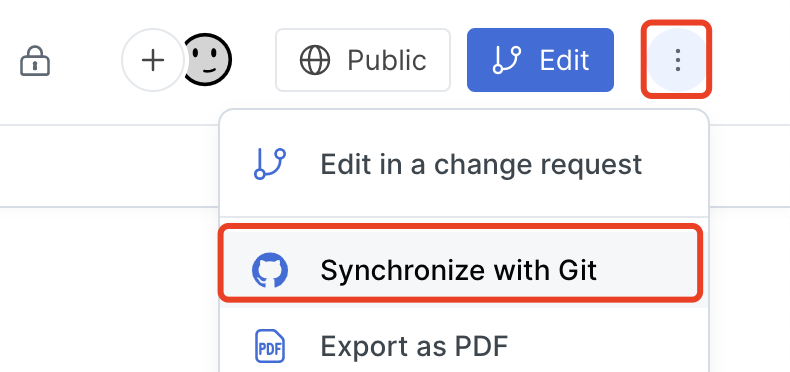

# Gitbook 超好用的

最近打算整理近几年的笔记，就需要一个好用的软件。以下是我的需求：

* 支持Markdown 在线编辑
* 笔记内容可掌控

我认为，富文本编辑器已进入2.0时代，代表产品有飞书文档，Logseq等。它们的特点就是没有了恶心的功能栏，而是通过输入的 markdown 标签，实时渲染。

例如，敲入`#加空格` 就能得到一个一级标题。

&#x20;另外，我的一个使用习惯就是使用本地，而非线上存储。因为任何服务商都有倒闭的风险，因此你的数据也有丢失的风险。

Gitbook 完美满足了以上需求，除此之外，给了其他功能：

* 支持自定义域名
* SEO

不过，Gitbook 仅对个人用户免费。😅

### 几分钟搞定Gitbook配置

#### Gitbook 文件组织层级

Gitbook给了三种文件组织层级。分别是：

* Organization
* Collection
* Space

它们从大大小，依次表示组织、集合、空间。

例如，你要写一个关于 React 的文档，那么就可以创建一个叫做`React 全解析的` 空间，它里面会包含若干页面。

假如你还写了一个叫做`vue全解析` 的文档，就可以把它和上面的`react 全解析` 一起，放到一个叫做`前端大杂烩` 的集合里面。

全部的空间和集合，组成了`组织`。

#### 发布

可以从组织、集合、空间等不同维度进行发布，Gitbook 会自行组织最终页面的展示效果。

我这里根据自己的经验，介绍一下`空间维度` 发布的自定义域名配置方式。

首先，来到space界面，点击左上角发布：

<figure><figcaption></figcaption></figure>

可见性选择 Public：

<figure><figcaption></figcaption></figure>

> 其他选项需要升级为付费用户

下一步，点击确认后，接下来进行自定义域名配置：

<figure><figcaption></figcaption></figure>

<figure><figcaption></figcaption></figure>

先输入域名，随后Gitbook会检查DNS配置：

<figure><figcaption></figcaption></figure>

然后，你需要将以上界面的CNAME信息复制出来，在你域名的DNS解析中添加一条CNAME 配置。然后重试一次。

配置好以后，space右上角会显示已公开，点击Public后可查看当前配置的自定义域名。

<figure><figcaption></figcaption></figure>

#### 配置github 同步

先说结论：

* 可选择同步方向，github -> gitbook 或者 gitbook -> github
* 支持选择git仓库分支，支持选择子目录
* 支持图片同步
* 文件编辑后随即出发同步行为

下面介绍具体步骤。

点击右上角菜单，然后在下拉列表中选择git同步：

<figure><figcaption></figcaption></figure>

Provider可以选择github或gitlab，根据自己喜好进行选择即可。

我选择的是github，接下来Gitbook会提示你进行登录，如果是第一次使用，还需要账户上安装github app，然后才能在账户选择里面找到自己的账户。

<figure><figcaption></figcaption></figure>

在安装github app的时候，会询问app所能访问的仓库权限。这个时候可以创建一个新的仓库，将app的访问权限限定在这个仓库内。

最后，在仓库选择框里，应该可以找到刚才新建的仓库：

<figure><figcaption></figcaption></figure>

接着，根据提示选择分支、子目录、同步方向即可：

<figure><figcaption></figcaption></figure>

### 总结

接下来我的公开笔记会在这个gitbook空间更新。
